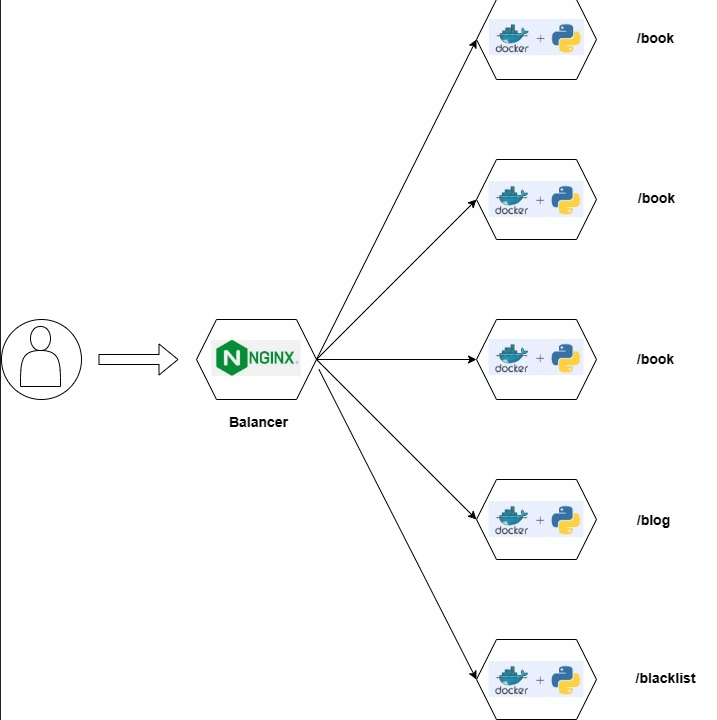

# Microservices-FastAPI-Docker-Nginx
```
Basic structure of microservices is implemented with FastAPI, Docker and NGINX
```

## Installation
```
- Ensure you have Docker installed

- Ensure you have python3 installed

- Clone the repository `https://github.com/carrillo07a/microservices-fastapi-docker.git`

- Open the terminal in the root directory of the project `docker-compose up -d --build`

- Show the logs `docker-compose logs`

- Stop and delete all the container `docker-compose down`

- Stop all the container ` docker-compose stop`

- Stop a single container ` docker-compose stop <ID-CONTAINER>`

- Container list `docker container ls`

- Balancing is applied to the book container
```

## Endpoint

```
http://localhost/book

http://localhost/blog

http://localhost/blacklist
```

## Diagram



